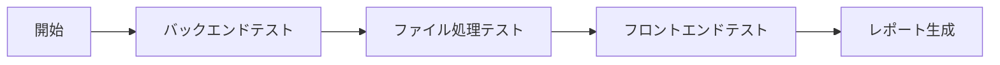
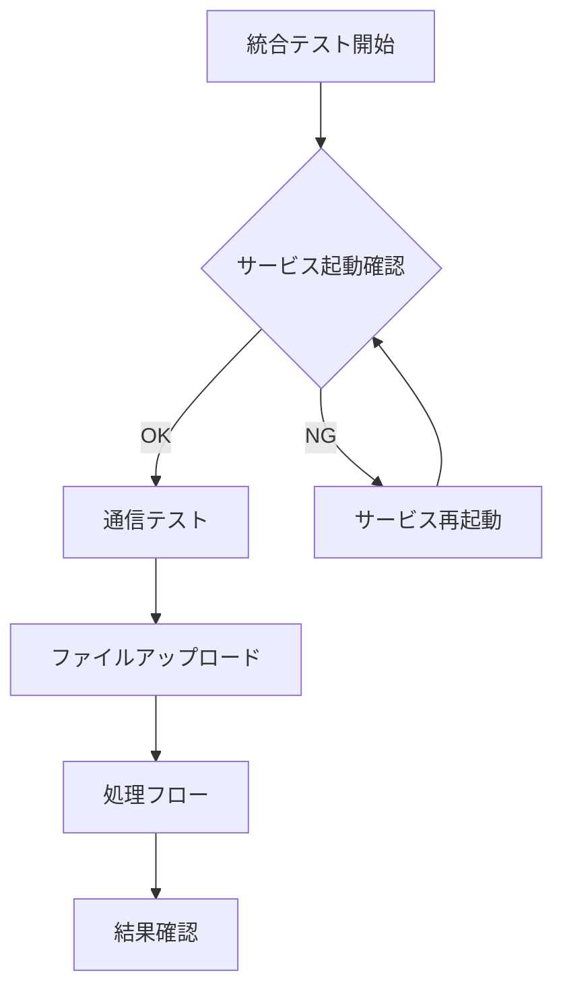
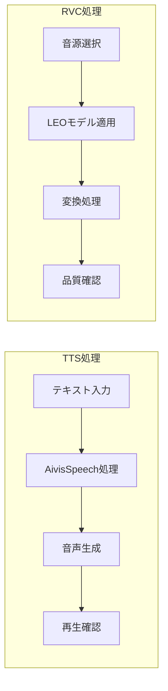
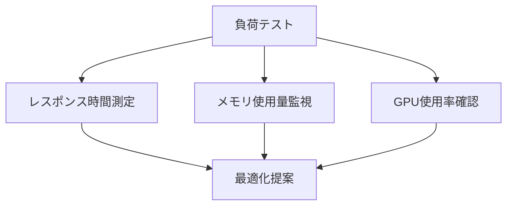

# MioVo ローカル環境テストフロー完全ガイド

## 📋 前提条件チェックリスト

### 必須環境
- [ ] **OS**: Windows 10/11、macOS、またはLinux
- [ ] **GPU**: NVIDIA RTX 3060以上（CUDA 11.8+）
- [ ] **RAM**: 16GB以上（32GB推奨）
- [ ] **Storage**: 50GB以上の空き容量
- [ ] **Python**: 3.10または3.11
- [ ] **Node.js**: v20.x
- [ ] **Docker**: Docker Desktop最新版
- [ ] **Git**: 最新版

## 🚀 セットアップフロー

### Step 1: リポジトリのクローンと準備

```bash
# リポジトリをクローン
git clone https://github.com/leococonut8585/MioVo.git
cd MioVo

# 最新の変更を取得
git pull origin main
```

### Step 2: 環境構築

#### 2.1 Python仮想環境のセットアップ
```bash
# 仮想環境作成
python -m venv venv

# 活性化
# Windows:
.\venv\Scripts\activate
# Mac/Linux:
source venv/bin/activate

# 依存パッケージインストール
pip install --upgrade pip
pip install -r backend/requirements.txt
pip install torch torchvision torchaudio --index-url https://download.pytorch.org/whl/cu118
```

#### 2.2 Node.js依存関係のインストール
```bash
npm install
npm run build
```

#### 2.3 Docker環境の起動
```bash
cd docker
docker-compose build
docker-compose up -d
cd ..
```

### Step 3: サービスの起動

#### 3.1 AivisSpeech Engine起動
```bash
# 別ターミナルで実行
cd external/aivisspeech
./start_engine.sh  # or start_engine.bat on Windows
# ポート10101で起動確認
```

#### 3.2 RVCサービス起動
```bash
# 別ターミナルで実行
cd backend/rvc
python server.py --port 10102 --gpu 0
# ポート10102で起動確認
```

#### 3.3 バックエンドGateway起動
```bash
# 別ターミナルで実行
cd backend/gateway
uvicorn main:app --reload --port 8000
# http://localhost:8000/docs でSwagger UI確認
```

#### 3.4 フロントエンド起動
```bash
# 別ターミナルで実行
npm run electron:dev
# Electronアプリが自動起動
```

## 🧪 テストフロー実行

### Phase 1: 単体テスト実行（15分）



#### 1.1 バックエンドAPIテスト
```bash
cd backend/tests
pytest api_test.py -v --html=report_api.html
# 期待: 6/6 passed
```

#### 1.2 ファイル処理テスト
```bash
pytest file_test.py -v --html=report_file.html
# 期待: 14/14 passed
```

#### 1.3 フロントエンドテスト
```bash
npm test
# 期待: 20/20 passed
```

### Phase 2: 統合テスト実行（30分）



#### 2.1 サービス間通信テスト
```bash
node tests/integration-test.cjs
# 期待: 33/33 passed（CORSヘッダーも含む）
```

#### 2.2 エンドツーエンドテスト
```bash
npm run e2e:test
# Electronアプリでの完全な操作テスト
```

### Phase 3: 音声処理実機テスト（45分）



#### 3.1 TTS（朗読モード）テスト

##### テストケース1: 基本音声合成
```python
# テストスクリプト: test_tts_basic.py
test_text = "こんにちは、MioVoのテストです。"
speaker_id = 0  # デフォルト話者
params = {
    "speed": 1.0,
    "pitch": 0.0,
    "intonation": 1.0
}
# 期待出力: 3-5秒の自然な音声
```

##### テストケース2: パラメータ調整
```python
# 各パラメータの極値テスト
speed_values = [0.5, 1.0, 2.0]
pitch_values = [-12, 0, 12]
intonation_values = [0.0, 1.0, 2.0]
```

#### 3.2 RVC（歌唱モード）テスト

##### テストケース1: LEOモデル音声変換
```python
# 入力: Iron Lion (Vocals Only).wav
# モデル: LEO (学習済み)
# パラメータ:
f0method = "rmvpe"
protect = 0.33
index_rate = 0.75

# 期待出力: LEOの声質で歌唱
```

##### テストケース2: フルトラック処理
```python
# 入力: Iron Lion.wav（フル音源）
# 処理フロー:
# 1. Demucsでボーカル分離
# 2. LEOモデルで変換
# 3. 楽器トラックと再合成
# 期待処理時間: 60-90秒
```

### Phase 4: パフォーマンステスト（30分）



#### 4.1 処理速度ベンチマーク
```bash
python benchmarks/performance_test.py
```

##### 期待値
- TTS処理: リアルタイム（1秒のテキスト→1秒以内に生成）
- RVC処理: 3-5倍速（1分の音源→12-20秒で処理）
- メモリ使用: 8GB以下
- GPU使用率: 60-80%

#### 4.2 同時処理テスト
```python
# 複数リクエストの並行処理
concurrent_requests = 5
# 期待: すべて正常完了、キューイング動作確認
```

## 📊 テスト結果確認ポイント

### 成功基準

| カテゴリー | 合格ライン | 確認方法 |
|-----------|-----------|----------|
| API応答時間 | < 100ms | `curl -w "%{time_total}"` |
| TTS品質 | MOS > 4.0 | 主観評価 |
| RVC品質 | 自然な音質 | A/Bテスト |
| メモリリーク | なし | 長時間実行監視 |
| エラー率 | < 1% | ログ分析 |

### トラブルシューティング

#### GPUが認識されない場合
```bash
# CUDA確認
nvidia-smi
python -c "import torch; print(torch.cuda.is_available())"

# 解決策
# 1. CUDAドライバー更新
# 2. PyTorch再インストール
pip uninstall torch torchvision torchaudio
pip install torch torchvision torchaudio --index-url https://download.pytorch.org/whl/cu118
```

#### AivisSpeechが起動しない場合
```bash
# ポート確認
netstat -an | grep 10101

# 解決策
# 1. ファイアウォール設定確認
# 2. 別ポートで起動
./start_engine.sh --port 10201
```

#### RVC処理が遅い場合
```python
# GPU使用状況確認
import GPUtil
GPUtil.showUtilization()

# 解決策
# 1. バッチサイズ調整
# 2. f0methodを"dio"に変更（高速だが低品質）
```

## 🎯 最終確認チェックリスト

### 必須テスト項目
- [ ] すべてのユニットテスト合格
- [ ] 統合テスト33/33成功
- [ ] TTS音声生成確認
- [ ] LEOモデルでの変換成功
- [ ] Iron Lion楽曲の処理完了
- [ ] メモリリークなし
- [ ] エラーログなし

### 推奨テスト項目
- [ ] 10分以上の連続動作
- [ ] 異なる形式のファイル処理
- [ ] 大容量ファイル（>100MB）処理
- [ ] ネットワーク切断時の動作
- [ ] キャッシュクリア後の動作

## 📝 テスト完了後の作業

1. **テスト結果の記録**
   ```bash
   # レポート生成
   python generate_test_report.py > test_results_$(date +%Y%m%d).md
   ```

2. **ログの保存**
   ```bash
   # ログアーカイブ
   tar -czf logs_$(date +%Y%m%d).tar.gz logs/
   ```

3. **GitHubへのコミット**
   ```bash
   git add test-results/
   git commit -m "test: Complete local testing with LEO model"
   git push origin main
   ```

## 🚨 重要な注意事項

1. **GPU必須**: RVC/TTS処理にはNVIDIA GPUが必須です
2. **メモリ管理**: 長時間実行時はメモリ使用量を監視してください
3. **モデルファイル**: LEOモデルは`models/rvc-trained/LEO/`に配置
4. **音声ファイル**: テスト用音声は`test-data/audio/`に配置

## 📞 サポート

問題が発生した場合：
1. エラーログを確認: `logs/error.log`
2. GitHub Issuesで報告: https://github.com/leococonut8585/MioVo/issues
3. ドキュメント参照: `docs/troubleshooting.md`

---

**Last Updated**: October 16, 2025  
**Version**: 1.0.0  
**Author**: MioVo Development Team